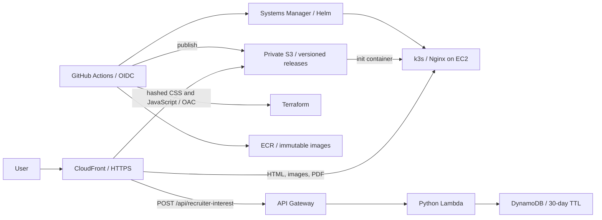

# Resume website

An English-language engineering portfolio with an Astro frontend, AWS infrastructure in Terraform, a k3s runtime, and GitHub Actions delivery.

[](https://github.com/OStach-adm01/resume-website/actions/workflows/ci.yml)

The repository is a portfolio lab. It uses a single Kubernetes node and does not claim high availability. Creating AWS resources requires a new account, a domain, and the deployment configuration described below. Local tests are not evidence of a successful cloud deployment. All website text, comments, and documentation are maintained in English.



## Run locally

Install Node.js using the version in `.nvmrc`, then:

```bash
npm ci
npm run dev
```

Open `http://127.0.0.1:4321`. The resume button is disabled until a PDF version is configured. To develop the modal locally, set `PUBLIC_RESUME_VERSION=demo` when starting Astro; no real PDF or API is included in that mode. The browser tests mock both endpoints.

```bash
make test
npx playwright install chromium
npm run test:e2e
npm run check
npm run build
node scripts/lighthouse.mjs
```

`make infra-check` needs Terraform. `make chart-check` needs Helm and PyYAML. `bash scripts/install-tools.sh` installs checksum-verified validation binaries into `.artifacts/tools`; add that directory to your PATH. It supports Linux x86-64 CI/development machines. AWS runs ARM64 images.

## Add your own certificates

The gallery is deliberately empty. You supply the images and credential links, and are responsible for checking the links.

1. Place your course or certificate images in `app/public/certificates/`.
2. Add entries to `app/src/data/certificates.ts` in the order you want them displayed.
3. Commit and push. The image itself links to the supplied credential URL.

```ts
export const certificates: Certificate[] = [
  {
    title: 'Your completed course',
    issuer: 'Course provider',
    image: '/certificates/your-course.webp',
    verificationUrl: 'https://your-provider.example/your-credential',
    category: 'Certificate of completion',
  },
];
```

Use WebP/AVIF where practical, with approximately 720-pixel width. The gallery accepts credentials from any provider. There are no Credly embeds, badge requirements, external image requests, or automated verification requests.

## Publish the PDF later

The PDF is intentionally absent. Use the publisher role or a suitably scoped local profile:

```bash
export ARTIFACTS_BUCKET=resume-website-YOUR_ACCOUNT_ID-artifacts
bash scripts/publish-resume.sh /absolute/path/to/resume.pdf 2026-10-en
```

Set the GitHub `RESUME_VERSION` variable to `2026-10-en`, then deploy a new commit. PDF keys are immutable through the publishing script; S3 versioning is also enabled. A release manifest binds the website to its PDF version. Rollback restores that pair. To change only the PDF, publish a new version and a new site release; do not rewrite a published manifest.

The stable `/resume/latest/resume.pdf` alias is served by Nginx. The modal uses the versioned address, avoiding stale download links across releases. The recruiter question measures self-declared interest; it is not authentication or a guarantee that a PDF was downloaded.

## Delivery and infrastructure

- Every push and pull request runs frontend, backend, browser, infrastructure, workflow, and container checks.
- Production deployment is disabled until the repository variable `DEPLOY_ENABLED=true` is set.
- A successful push to `main` applies Terraform, publishes a release, deploys Helm through SSM, invalidates the CDN, and checks the public endpoint.
- AWS access uses GitHub OIDC, not stored AWS access keys. Fork pull requests receive no deployment credentials.
- Certificate URLs are not crawled or validated by CI.
- The scheduled workflow reports infrastructure drift, endpoint failure, or an approaching Free Plan expiry. It never applies changes.

See [deployment](docs/deployment.md), [architecture and decisions](docs/architecture.md), [operations](docs/operations.md), and [validation evidence](docs/validation.md).

## Repository map

```text
app/                 Astro pages, styling, course data, and public images
backend/recruiter/   Lambda request validation and idempotent persistence
infra/bootstrap/     Protected Terraform state, GitHub OIDC, role boundaries
infra/platform/      AWS hosting, networking, API, observability, and DNS
charts/resume/       Kubernetes runtime and Nginx configuration
containers/nginx/   Unprivileged runtime and optional local preview image
scripts/             Publishing, deployment, smoke checks, and tool setup
tests/               Unit, browser, backend, and container fixtures
.github/workflows/  CI, production deployment, rollback, and drift checks
```

## Cost boundary

EC2, EBS, public IPv4, ECR, S3, Lambda, API Gateway, DynamoDB, and monitoring may consume credits or incur charges. Budgets are alerts, not hard spending caps. A domain is a separate purchase. Free Plan expiry and credit exhaustion are operational deadlines; a Kubernetes node does not become permanently free because it is Free Tier eligible.

The project excludes EKS, NAT Gateway, a load balancer, and paid observability stacks. Review a current estimate before the first apply. Relevant official pricing: [EC2](https://aws.amazon.com/ec2/pricing/on-demand/), [VPC/IPv4](https://aws.amazon.com/vpc/pricing/), [CloudFront](https://aws.amazon.com/cloudfront/pricing/), and [AWS Free Tier](https://aws.amazon.com/free/free-tier-faqs/).
